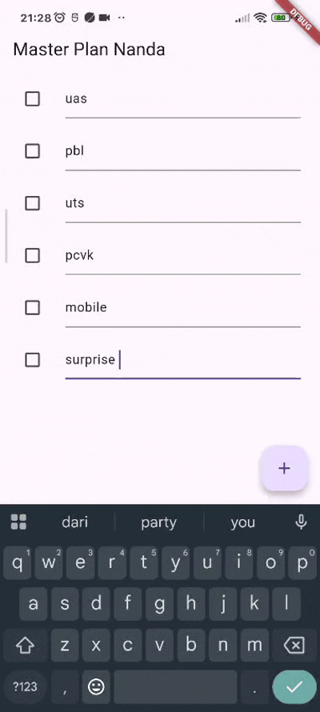

# JOBSHEET 10

###  **NIM:** 2341720048 
### **Nama:** Ananda Rahmawati

## Praktikum 1: Dasar State dengan Model-View

### 1. Dokumentasi hasil praktikum

### 2. Jelaskan maksud dari langkah 4 pada praktikum tersebut! Mengapa dilakukan demikian?
**Jawab:** Langkah 4 bertujuan menyatukan seluruh model dalam satu file ekspor sehingga proses import lebih sederhana. Dengan mengekspor task.dart dan plan.dart melalui data_layer.dart, struktur kode menjadi lebih rapi, mudah dikelola, dan mengikuti praktik pemisahan data layer pada arsitektur aplikasi.

### 3. Mengapa perlu variabel plan di langkah 6 pada praktikum tersebut? Mengapa dibuat konstanta ?
**Jawab:** Variabel plan digunakan sebagai state utama yang menyimpan daftar tugas yang ditampilkan pada layar. Objek Plan dibuat const karena model dirancang bersifat immutable, sehingga setiap perubahan dilakukan dengan membuat instance baru, bukan memodifikasi yang lama sehingga mencegah bug saat state berubah.

### 4. Lakukan capture hasil dari Langkah 9 berupa GIF, kemudian jelaskan apa yang telah Anda buat!

#### **Jawab:** Pada langkah 9 dibuat widget ListTile berisi checkbox dan TextFormField untuk setiap task. Checkbox digunakan untuk menandai tugas selesai, sementara TextFormField dipakai mengubah deskripsi. Semua perubahan langsung memperbarui state menggunakan setState(). 

### 5. Apa kegunaan method pada Langkah 11 dan 13 dalam lifecyle state ?
**Jawab:** initState() digunakan untuk inisialisasi awal seperti membuat ScrollController sebelum widget ditampilkan, sedangkan dispose() membersihkan controller ketika widget dihapus dari widget tree. Keduanya memastikan penggunaan resource yang benar sesuai lifecycle Flutter.

## Praktikum 2: Mengelola Data Layer dengan InheritedWidget dan InheritedNotifier

### 2. Jelaskan mana yang dimaksud InheritedWidget pada langkah 1 tersebut! Mengapa yang digunakan InheritedNotifier?
**Jawab:** InheritedWidget berfungsi sebagai mekanisme untuk membagikan data ke seluruh widget turunan tanpa harus mengirimnya lewat parameter. Namun, yang digunakan adalah InheritedNotifier karena selain mewariskan data, widget ini juga bisa memberi tahu widget lain ketika data berubah melalui ValueNotifier. Dengan demikian, UI akan otomatis ter-update setiap kali model Plan berubah, sehingga lebih efisien daripada InheritedWidget biasa yang tidak memiliki kemampuan notifikasi

### 3. Jelaskan maksud dari method di langkah 3 pada praktikum tersebut! Mengapa dilakukan demikian?
**Jawab:** Method completedCount dan completenessMessage ditambahkan agar perhitungan jumlah tugas yang selesai serta pesan progres dilakukan langsung di dalam model. Hal ini membuat UI lebih sederhana karena tidak perlu mengolah data sendiri. Dengan menempatkan logika di model, kode menjadi lebih rapi dan konsisten dengan prinsip pemisahan antara data dan tampilan.

### 4. Lakukan capture hasil dari Langkah 9 berupa GIF, kemudian jelaskan apa yang telah Anda buat!

#### **Jawab:** Pada langkah 9 tampilan aplikasi memang terlihat sama seperti hasil Praktikum 1, tetapi kini datanya tidak lagi dikelola langsung oleh widget melalui variabel lokal. Sebagai gantinya, data Plan sudah dipindahkan ke dalam InheritedNotifier melalui PlanProvider. Dengan perubahan ini, setiap perubahan pada tasks akan memicu pembaruan UI secara otomatis melalui mekanisme listenable.

## Praktikum 3: Membuat State di Multiple Screens

### 2. Berdasarkan Praktikum 3 yang telah Anda lakukan, jelaskan maksud dari gambar diagram berikut ini!
**Jawab:** Diagram tersebut menunjukkan perpindahan state ketika berpindah halaman menggunakan Navigator.push.
Di halaman pertama (PlanCreatorScreen), struktur widget masih sederhana dan hanya menampilkan input serta daftar rencana. Saat pengguna memilih sebuah rencana, aplikasi berpindah ke halaman kedua (PlanScreen). Diagram kanan menjelaskan bahwa halaman baru memiliki state sendiri dan tetap terhubung ke PlanProvider, sehingga perubahan task di halaman kedua tetap memengaruhi data utama. Intinya, diagram itu menjelaskan aliran state yang tetap konsisten meskipun berada di dua screen berbeda.

### 3. Lakukan capture hasil dari Langkah 14 berupa GIF, kemudian jelaskan apa yang telah Anda buat!

#### **Jawab:** Pada Langkah 14, ditunjukkan bahwa pengguna dapat membuat plan baru, kemudian masuk ke halaman detail plan, menambah task, mengubah status task, dan data langsung ter-update. Aplikasi memperlihatkan bahwa integrasi state antar-halaman sudah berjalan dengan benar: rencana baru muncul di daftar, task dapat ditambah, diedit, atau ditandai selesai, dan perubahan tersebut tersimpan selama aplikasi masih berjalan.