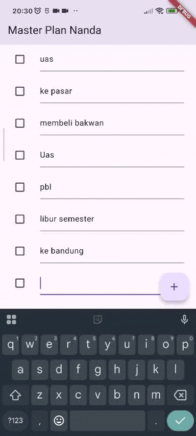
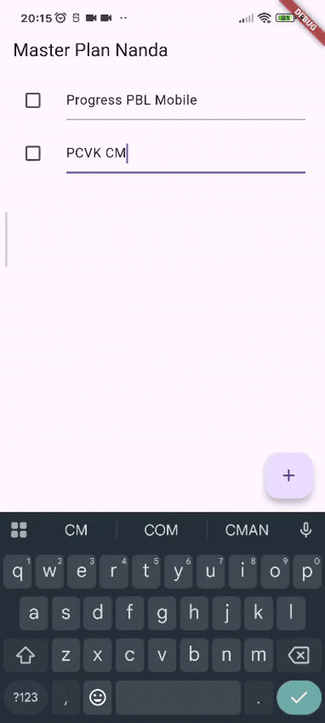

# JOBSHEET 10

###  **NIM:** 2341720048 
### **Nama:** Ananda Rahmawati

## Praktikum 1: Dasar State dengan Model-View

### 1. Dokumentasi hasil praktikum

### 2. Jelaskan maksud dari langkah 4 pada praktikum tersebut! Mengapa dilakukan demikian?
**Jawab:** Langkah 4 bertujuan menyatukan seluruh model dalam satu file ekspor sehingga proses import lebih sederhana. Dengan mengekspor task.dart dan plan.dart melalui data_layer.dart, struktur kode menjadi lebih rapi, mudah dikelola, dan mengikuti praktik pemisahan data layer pada arsitektur aplikasi.

### 3. Mengapa perlu variabel plan di langkah 6 pada praktikum tersebut? Mengapa dibuat konstanta ?
**Jawab:** Variabel plan digunakan sebagai state utama yang menyimpan daftar tugas yang ditampilkan pada layar. Objek Plan dibuat const karena model dirancang bersifat immutable, sehingga setiap perubahan dilakukan dengan membuat instance baru, bukan memodifikasi yang lama sehingga mencegah bug saat state berubah.

### 4. Lakukan capture hasil dari Langkah 9 berupa GIF, kemudian jelaskan apa yang telah Anda buat!

**Jawab:** Pada langkah 9 dibuat widget ListTile berisi checkbox dan TextFormField untuk setiap task. Checkbox digunakan untuk menandai tugas selesai, sementara TextFormField dipakai mengubah deskripsi. Semua perubahan langsung memperbarui state menggunakan setState(). 

### 5. Apa kegunaan method pada Langkah 11 dan 13 dalam lifecyle state ?
**Jawab:** initState() digunakan untuk inisialisasi awal seperti membuat ScrollController sebelum widget ditampilkan, sedangkan dispose() membersihkan controller ketika widget dihapus dari widget tree. Keduanya memastikan penggunaan resource yang benar sesuai lifecycle Flutter.