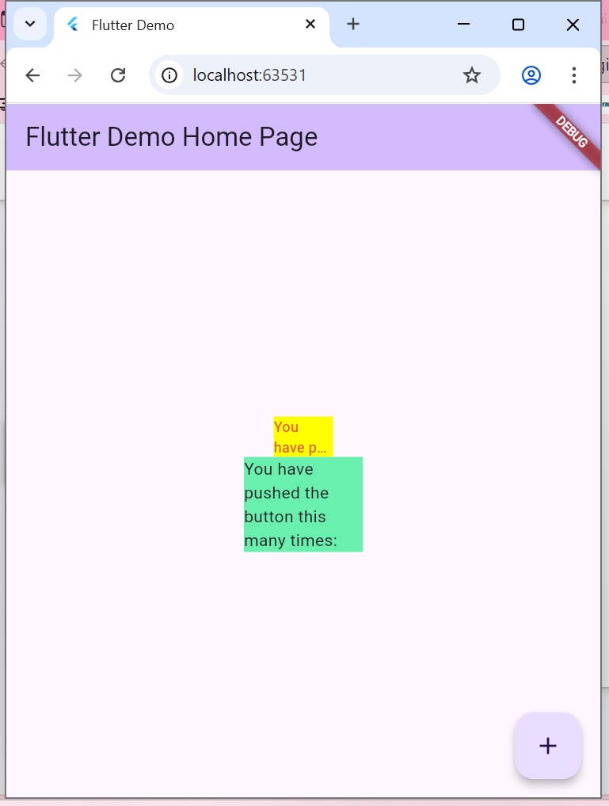

# flutter_plugin_pubdev (Jobsheet 7)

## Nama: Ananda Rahmawati  
## NIM: 2341720048

## Tugas Praktikum
### 1. Selesaikan Praktikum tersebut, lalu dokumentasikan dan push ke repository Anda berupa screenshot hasil pekerjaan beserta penjelasannya di file README.md!

#### Hasil Praktikum 1:

### 2. Jelaskan maksud dari langkah 2 pada praktikum tersebut!

 #### Jawab: perintah "flutter pub add auto_size_text" berfungsi untuk menambahkan dependensi (plugin/library) baru ke dalam proyek Flutter secara otomatis. Flutter akan mengunduh plugin auto_size_text dari pub.dev (repositori resmi paket Flutter dan Dart), lalu menambahkan entri dependensi baru ke dalam file pubspec.yaml. Plugin auto_size_text sendiri berfungsi untuk menampilkan teks yang dapat menyesuaikan ukuran font secara otomatis agar tetap muat dalam batas area tampilan widget. Dengan plugin ini, teks tidak akan terpotong meskipun panjang, karena ukuran font akan menyesuaikan secara dinamis.

### 3. Mengapa pada langkah 4 setelah penambahan kode muncul eror?

#### Jawab: setelah kode ditambahkan, akan muncul error pada program. Hal ini terjadi karena terdapat dua penyebab utama. Pertama, widget AutoSizeText belum dikenali oleh Flutter karena belum dilakukan import terhadap library yang menyediakannya, yaitu auto_size_text. Kedua, variabel text yang digunakan di dalam AutoSizeText belum dideklarasikan di kelas RedTextWidget. Flutter tidak mengetahui nilai teks apa yang harus ditampilkan, sehingga menghasilkan error “Undefined name 'text'”.

### 4. Jelaskan maksud dari langkah 5 pada praktikum tersebut!

#### Jawab: penambahan variabel text dan parameter di dalam konstruktor kelas RedTextWidget. Penambahan ini bertujuan untuk memberikan kemampuan pada widget RedTextWidget agar dapat menerima data teks dari luar saat digunakan. Variabel text dideklarasikan sebagai final, yang berarti nilainya bersifat tetap setelah diberikan melalui konstruktor. Kata kunci required menunjukkan bahwa parameter text wajib diisi ketika widget dipanggil, sehingga mencegah kesalahan saat pembuatan objek. Selain itu, penggunaan kata kunci const pada konstruktor memungkinkan widget ini bersifat konstan ketika semua parameternya juga bernilai konstan, sehingga dapat membantu Flutter mengoptimalkan performa aplikasi. Dengan langkah ini, error “Undefined name 'text'” yang sebelumnya muncul dapat diatasi karena variabel text kini telah terdefinisi dengan benar di dalam kelas.

### 5. Pada langkah 6 terdapat dua widget yang ditambahkan, jelaskan fungsi dan perbedaannya!

#### Jawab: Widget pertama menggunakan RedTextWidget, Widget ini menampilkan teks berwarna merah dengan ukuran huruf yang dapat menyesuaikan secara otomatis menggunakan plugin AutoSizeText. Tujuan penggunaannya adalah untuk memastikan teks tetap terbaca dengan baik meskipun ruang tampilan terbatas, karena ukuran font akan menyesuaikan secara dinamis agar tidak terpotong. Selain itu, RedTextWidget dibungkus dengan Container berwarna kuning (Colors.yellowAccent) dengan lebar 50 piksel, sehingga tampilannya lebih kecil dan berfungsi sebagai contoh bagaimana AutoSizeText bekerja untuk menyesuaikan ukuran teks secara otomatis dalam ruang yang terbatas.

#### Sementara itu, widget kedua menggunakan Text bawaan Flutter, yang berfungsi menampilkan teks statis tanpa penyesuaian ukuran otomatis. Widget ini ditempatkan di dalam Container berwarna hijau muda. Perbedaan utama antara keduanya terletak pada kemampuan penyesuaian ukuran teks. RedTextWidget (melalui AutoSizeText) mampu menyesuaikan ukuran font agar teks tidak terpotong saat ruang terbatas, sedangkan Text biasa tidak memiliki kemampuan tersebut dan dapat menyebabkan teks terpotong bila area terlalu kecil.

### 6. Jelaskan maksud dari tiap parameter yang ada di dalam plugin auto_size_text berdasarkan tautan pada dokumentasi ini !

#### Jawab: 
- key -> Digunakan oleh Flutter untuk membedakan satu widget dengan widget lainnya di dalam tampilan aplikasi.
- textKey -> Memberikan tanda khusus (key) pada teks di dalam AutoSizeText, berguna jika kita ingin mengontrol teks itu secara spesifik.
- style -> Mengatur tampilan teks seperti warna, ukuran huruf, dan jenis font.
- minFontSize ->  Menentukan ukuran huruf paling kecil yang boleh dipakai saat teks mengecil agar tetap muat di layar.
- maxFontSize -> Menentukan ukuran huruf paling besar yang boleh digunakan.
- stepGranularity -> Menentukan seberapa besar perubahan ukuran huruf saat teks disesuaikan (misalnya mengecil sedikit demi sedikit).
- presetFontSizes -> Menyediakan daftar ukuran huruf yang sudah ditentukan sebelumnya, dan AutoSizeText akan mencoba ukuran-ukuran itu satu per satu sampai teks pas.
- group -> Digunakan jika kita ingin beberapa AutoSizeText memiliki ukuran huruf yang sama secara otomatis.
- textAlign -> Mengatur posisi teks secara horizontal, misalnya di kiri, tengah, atau kanan.
- textDirection -> Menentukan arah penulisan teks, misalnya dari kiri ke kanan (seperti bahasa Indonesia) atau kanan ke kiri (seperti bahasa Arab).
- locale ->  Mengatur bahasa atau wilayah agar font yang digunakan sesuai dengan gaya bahasa tersebut.
- softWrap -> Menentukan apakah teks boleh berpindah ke baris baru saat panjangnya melebihi lebar layar.
- wrapWords -> Mengatur apakah kata yang panjang boleh dipindah ke baris berikutnya agar tetap terbaca utuh.
- overflow -> Menentukan apa yang terjadi kalau teks terlalu panjang, misalnya dipotong dan ditambahkan tanda titik tiga (...).
- overflowReplacement -> Menampilkan widget pengganti kalau teks tidak muat di area tampilannya.
- textScaleFactor -> Mengatur seberapa besar ukuran teks dibandingkan ukuran standarnya (misalnya untuk memperbesar semua teks).
- maxLines ->  Menentukan jumlah baris maksimal yang boleh ditampilkan sebelum teks dipotong.
- semanticsLabel ->  Memberikan teks alternatif untuk pembaca layar, agar aplikasi tetap ramah bagi pengguna disabilitas.

