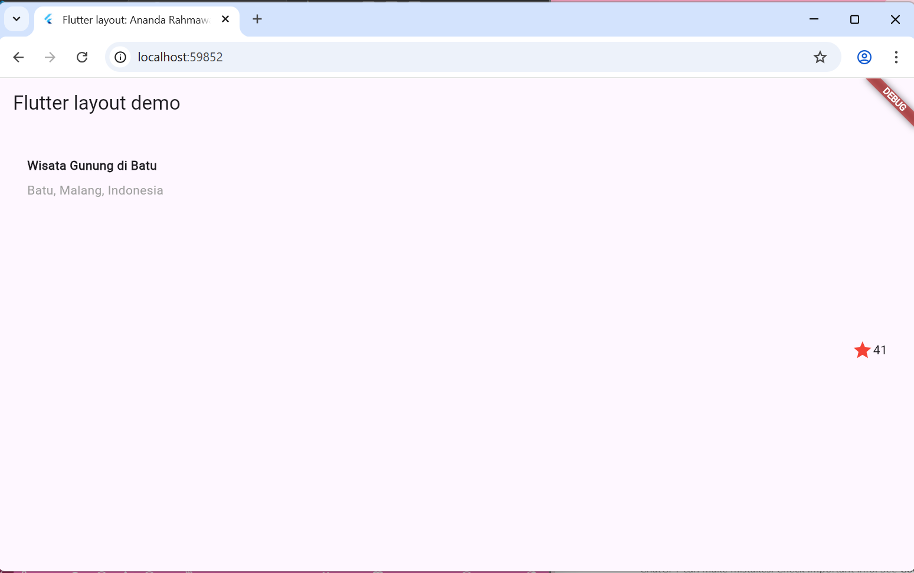
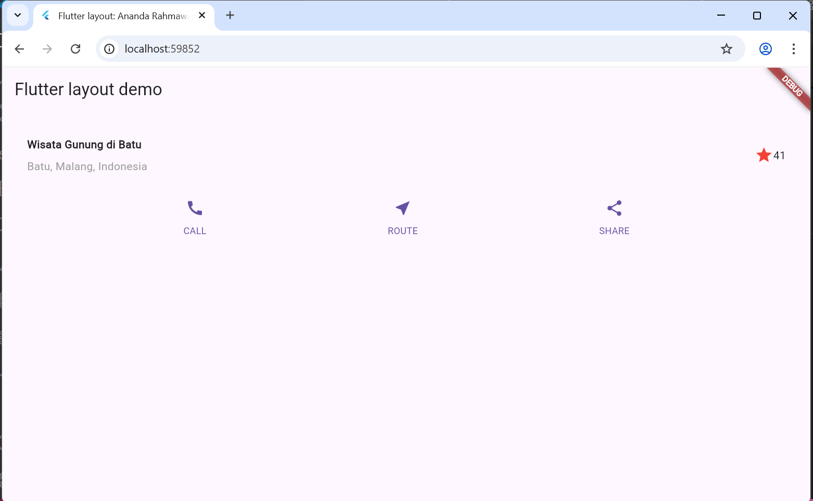
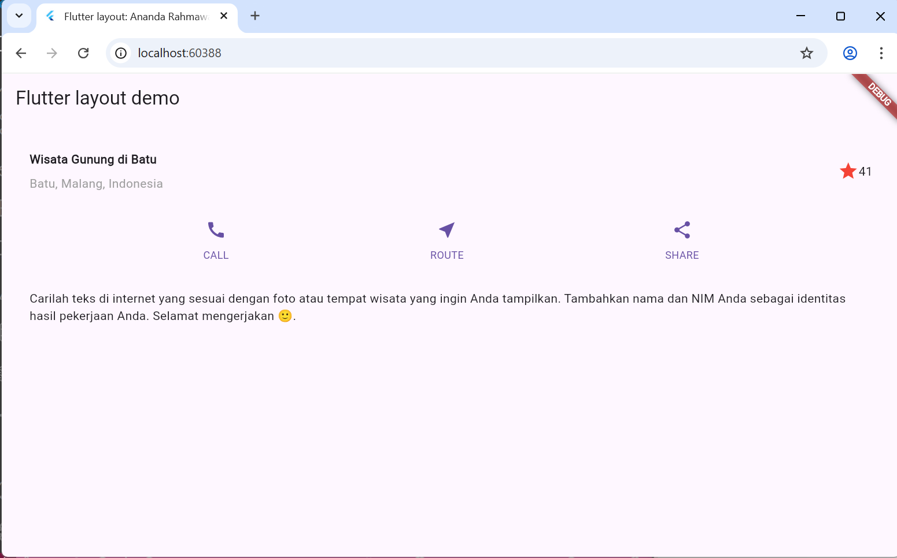
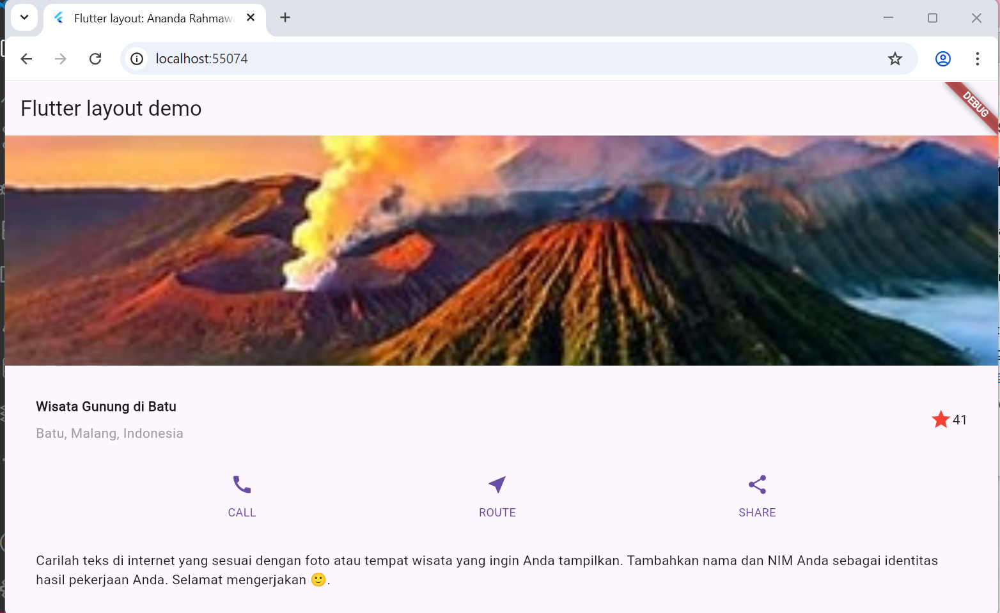
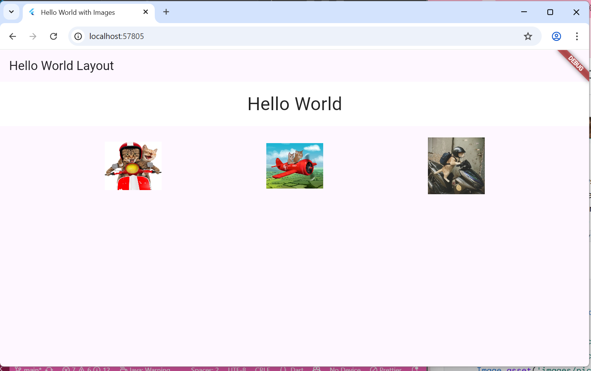
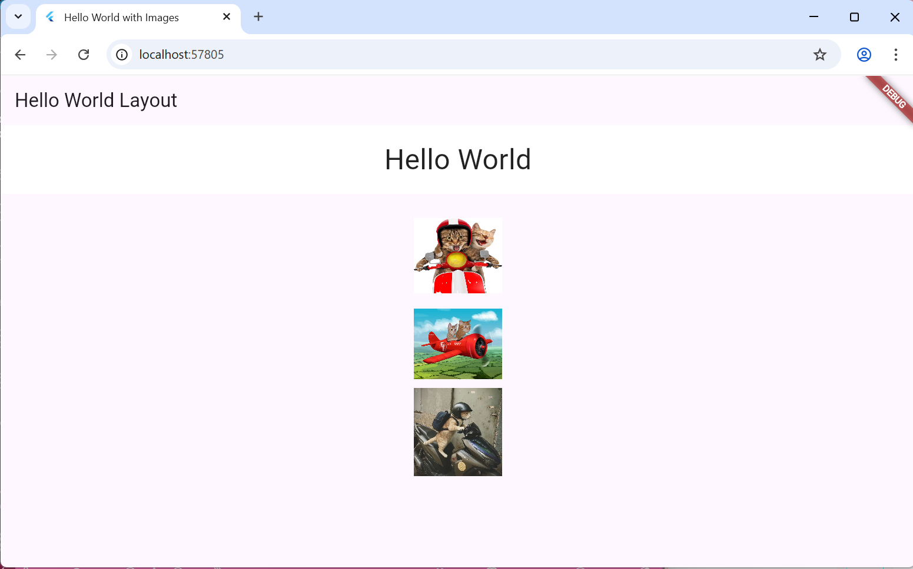
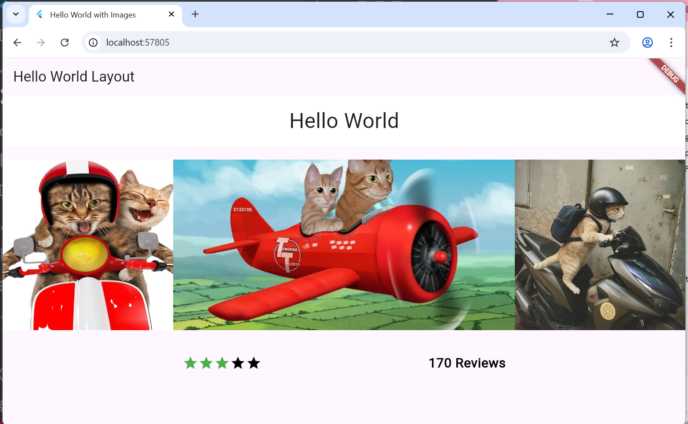
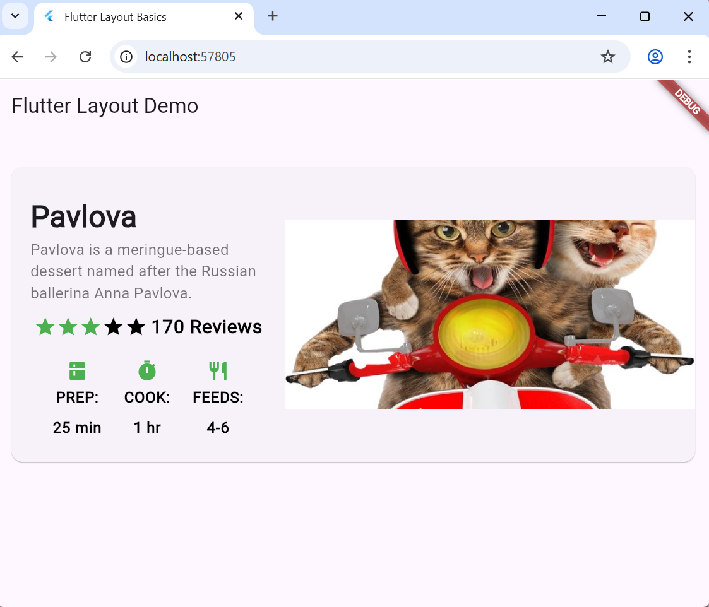

# layout_flutter
# Praktikum Mobile Jobsheet 6

**NIM:** 2341720048
**Nama:** Ananda Rahmawati

## Praktikum 1: Membangun Layout di Flutter

## Praktikum 2: Implementasi button row

## Praktikum 3: Implementasi text section

## Praktikum 4: Implementasi image section

# Tugas Praktikum 1

## Aligning widgets
### Row

### Column

## Sizing widgets & Packing widgets

## Nesting rows and columns

## final result
